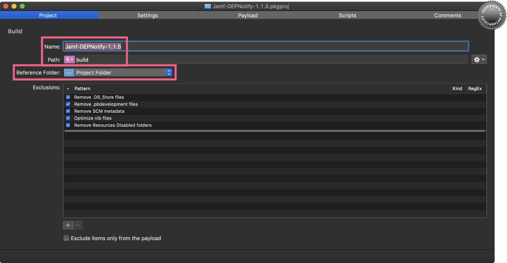
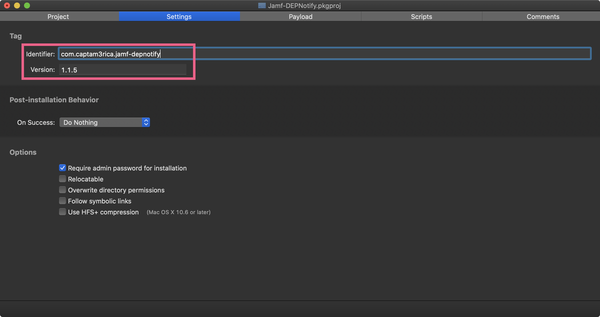
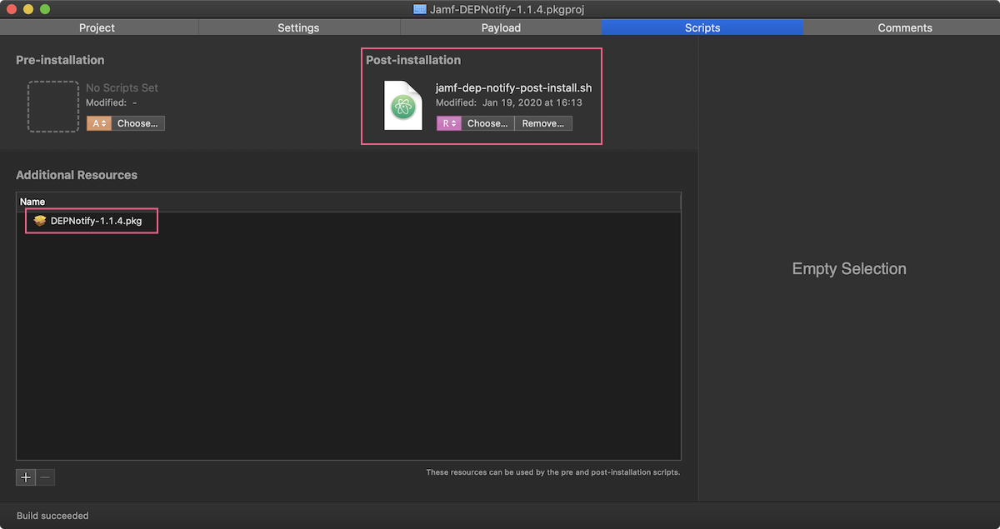
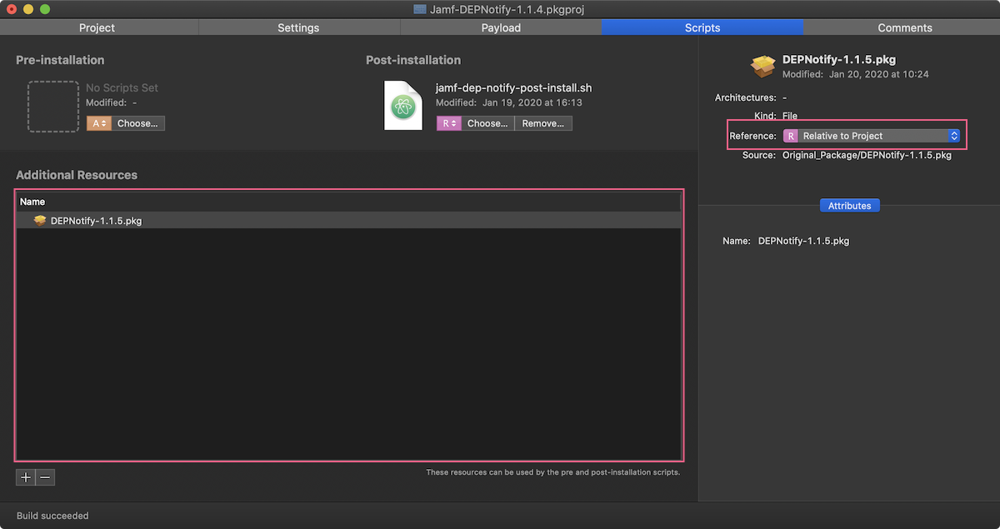
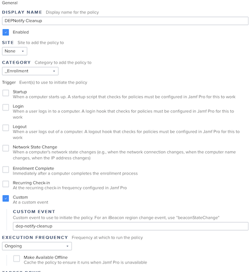

# Jamf DEPNotify

Use these scripts to assist with deployment and execution of DEPNotify in a Jamf MDM environment.

## Scripts

- `jamf-dep-notify-post-install.sh` - Use as the post-install script when repackaging the DEPNotify app for deployment.
- `jamf-dep-notify-start-enrollment.sh` - Use as the enrollment script in your Jamf enrollment Policy. This should be policy executed by the DEPNotify post-install script.
- `jamf-dep-notify-cleanup.sh` - Use this script in a policy called by the `jamf-dep-notiy-start-enrollment` policy. Removes the DEPNotify application and all of its dependencies.

## Jamf DEPNotify Re-Package

This example uses [Packages](http://s.sudre.free.fr/Software/Packages/about.html) to repackage the DEPNotify app.

### Project Tab

Give the project a **Name**, set the path to **Relative to Project**, and select a **Reference Folder** (The place where you want to store the project.)

Signing the package is not necessary, but this is something that Apple will be requiring in later releases of macOS.

### Settings Tab

Set the **identifier** and a version number on the Settings tab if you wish. I like to set the version number to the version of the original application that I am working with. In this case DENotify is on 1.1.5.

### Scripts Tab

On the Scripts tab drag the `jamf-dep-notify-post-install.sh` script into the square. Make sure that the **R** for Relative to Project opation is selected underneath the script.

Drag the original [DEPNotify app](https://gitlab.com/Mactroll/DEPNotify) installer into the **Additional Resources** area, and make sure that the **Reference** is set to **Relative to Project**.

## Jamf Policies

### Jamf DEPNotify Start Enrollment

Policy options for the Enrollment Script

### Jamf DEPNotify Cleanup

General settings tab

