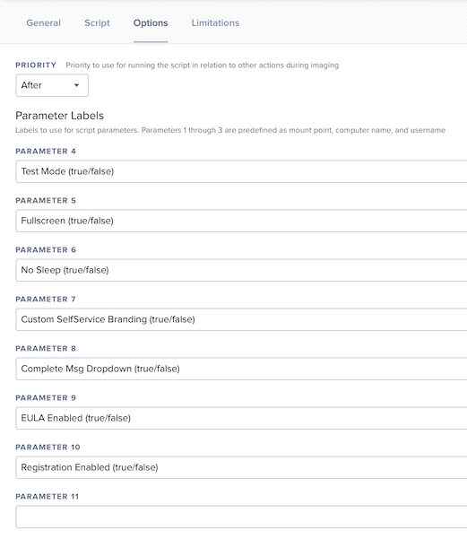

# Jamf DEPNotify Scripts

Use these scripts to assist with deployment and execution of DEPNotify in a Jamf MDM environment.

## Scripts

- `jamf-dep-notify-post-install.sh` - Use as the post-install script when repackaging the DEPNotify app for deployment.
- `jamf-dep-notify-start-enrollment.sh` - Use as the enrollment script in your Jamf enrollment Policy. This should be policy executed by the DEPNotify post-install script.
- `jamf-dep-notify-cleanup.sh` - Use this script in a policy called by the `jamf-dep-notiy-start-enrollment` policy. Removes the DEPNotify application and all of its dependencies.

## Jamf Policies

### Jamf DEPNotify Start Enrollment

Policy options for the Enrollment Script

### Jamf DEPNotify Cleanup

General settings tab

![](Screenshots/dep_notify_cleanup_general_settings.png
