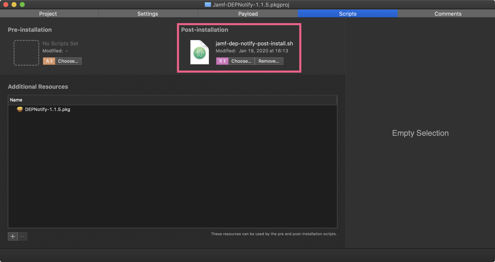

# Jamf DEPNotify

Use this repo to assist with deployment of **[DEPNotify](https://gitlab.com/Mactroll/DEPNotify)** in a Jamf MDM environment.

## Scripts

- `jamf-dep-notify-start-enrollment.sh` - Use as the enrollment script in your Jamf enrollment Policy. This should be policy executed by the DEPNotify post-install script.
- `post-install.sh` - Use as the post-install script when repackaging the DEPNotify app for deployment.

## Jamf DEPNotify Re-Package

This example uses [Packages](http://s.sudre.free.fr/Software/Packages/about.html) to repackage the DEPNotify app.

### Project Tab

Give the project a **Name**, set the path to **Relative to Project**, and select a **Reference Folder** (The place where you want to store the project.)

Signing the package is necessary. As a part of this process the package is uploaded to Jamf and added to a Prestage Enrollment profile. The package needs to be signed inorder to use it in a Jamf Prestage Enrollment profile.

### Settings Tab

Set the **identifier** and a version number on the Settings tab if you wish. I like to set the version number to the version of the original application that I am working with. In this case DENotify is on 1.1.5.

### Scripts Tab

On the Scripts tab drag the `jamf-dep-notify-post-install.sh` script into the square. Make sure that the **R** for Relative to Project opation is selected underneath the script.

Drag the original [DEPNotify app](https://gitlab.com/Mactroll/DEPNotify) installer into the **Additional Resources** area, and make sure that the **Reference** is set to **Relative to Project**.

### Build the Package

Once everything is in the new package press **Command + S** to save your work. Then, press **Command + B** to build the package.

### Upload the Package to Jamf

Once the package is created upload it to Jamf. Then add the package to your Pre-Stage Enrollment profile.

## Update the `jamf-dep-notify-start-enrollment.sh` Script

Make sure to update the policy array section of the script to include the customer triggers policies that you would like to have installed during the provisioning process. The second portion of each item in the array following the comma should match the customer trigger in the associated policy in Jamf.

The policies in this array will install in the order that they appear in the array.

## Jamf Policies

**NOTE:** Make sure to upload `jamf-dep-notify-start-enrollment.sh` to Jamf as a script before creating the policies.

### Jamf DEPNotify Start Enrollment

**General settings tab**

**Scripts payload tab**

**Policy Scope**

You can scope the policy to **All Computers/All Users** or create a Smart Group with the following criteria and scope this policy to that smart group.

_Smart Group_

_Scope_

