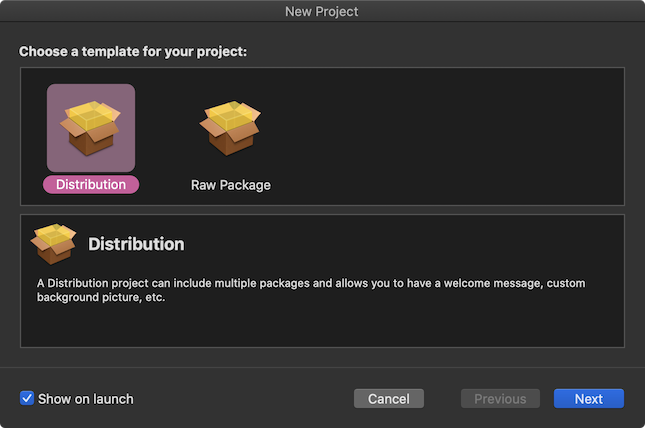
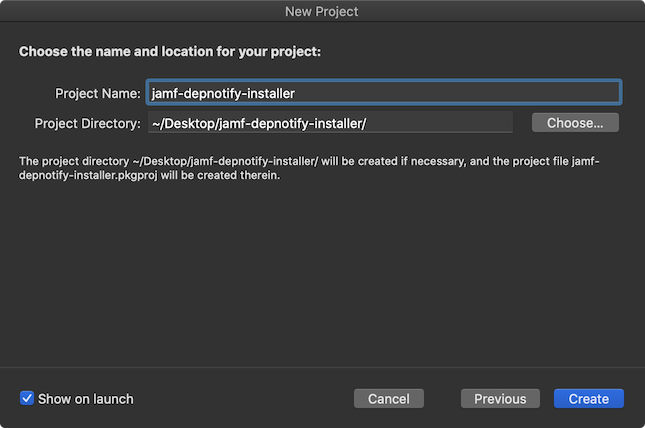
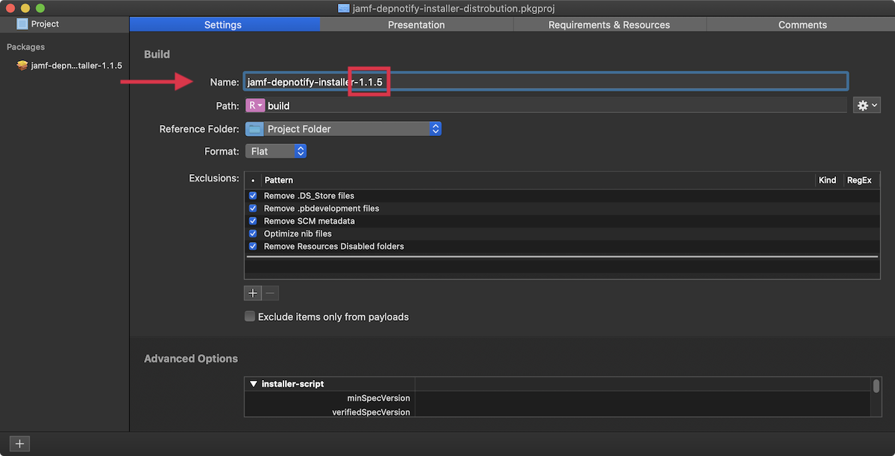
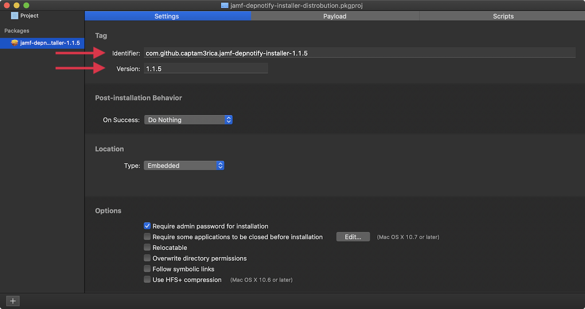
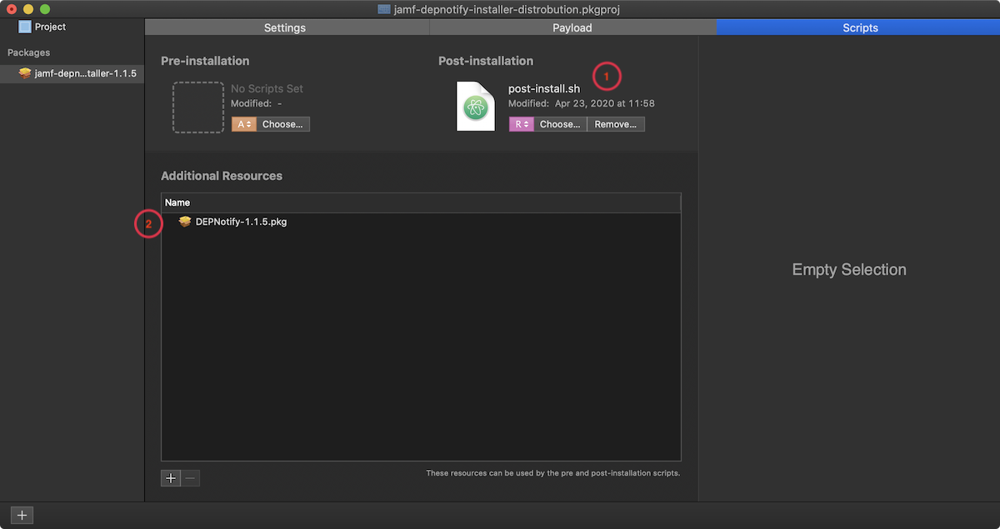
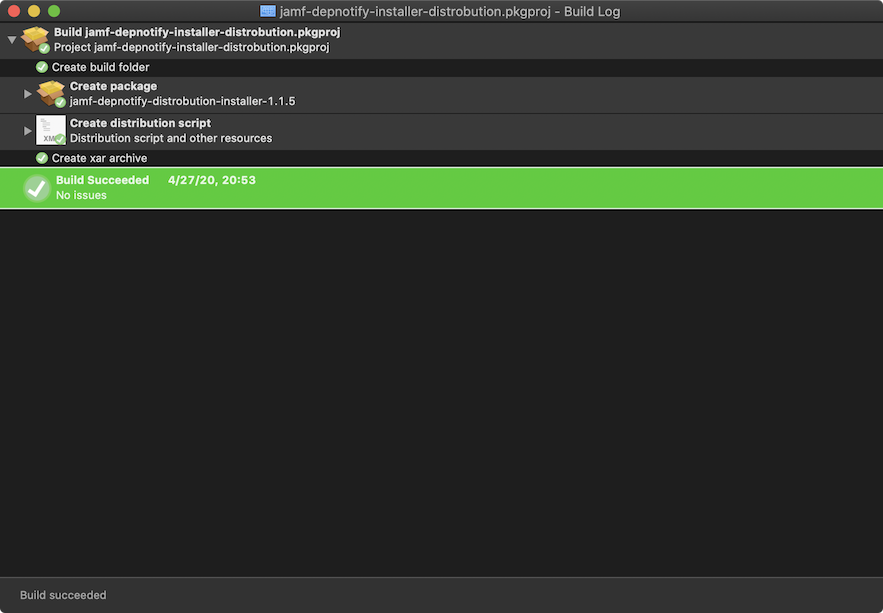
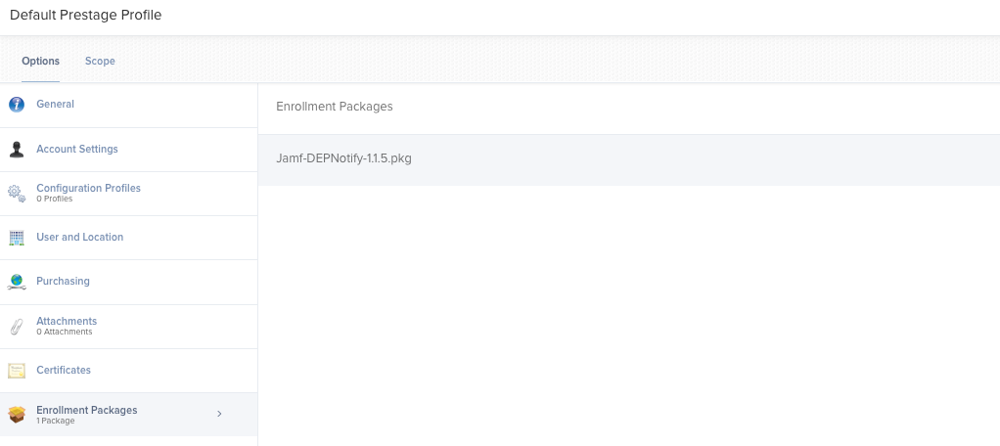
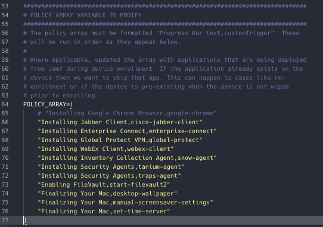

# jamf-depnotify-installer

About
===

Use this repo to assist with deployment of **[DEPNotify](https://gitlab.com/Mactroll/DEPNotify)** in a Jamf MDM environment.

Requirements
===

- A copy of the **[DEPNotify](https://gitlab.com/Mactroll/DEPNotify)** installer package.
- A macOS package builder.

    This repo uses [Packages](http://s.sudre.free.fr/Software/Packages/about.html), but there are others that can be used as well.
    
- A certificate that can be used to sign Installer packages.

    The cert can either be an Apple Developer Cert or a cert downloaded from your Jamf Cloud tenant.

Create a Signing Cert
===

Build the Installer Package
===

This example uses [Packages](http://s.sudre.free.fr/Software/Packages/about.html) to repackage the DEPNotify app.

A copy of the `.pkgproj` file that I used to create my installer package can be found [here](https://github.com/icwfrepo/DEPNotifyers/tree/master/jamf-depnotify-installer/packages-project).

### New Project

Launch **Packages** and create a new distribution project.

Give the project a **Name**, set the path to **Relative to Project**, and select a **Reference Folder** (The place where you want to store the project.)

### Main Settings Tab

On the **Settings** tab add the current DEPNotify version to the end of the package name. As of this writing DEPNotify is on version 1.1.5

### Package Settings Tab

On the left-hand side select the `jamf-depnotify-installer` package.

On the the package Settings tab set the **Identifier** and a **Version** number on the Settings tab if you wish. I like to set the version number to the version of the original application that I am working with. In this case DENotify is on 1.1.5.

The identifier will become the bundleID for this package.

### Payload Tab (Optional)

If you plan on displaying icons in DEPNotify as the Mac is being configured buildout a directory structure similar to the below then drag your images into the icons folder.

An easy way to do this is to create the folder structure on your Mac then drag the top level folder into the Package Payload tab.

### Scripts Tab

1. On the Scripts tab drag the `post-install.sh` script into the square. Make sure that the **R** for Relative to Project option is selected underneath the script.

2. Drag the original [DEPNotify app](https://gitlab.com/Mactroll/DEPNotify) installer package into the **Additional Resources** area, and make sure that the **Reference** is set to **Relative to Project**.

### Build the Package

Once everything is in the new package press **Command + S** to save your work. Then, press **Command + B** to build the package.

Upload the Package to Jamf
===

### Upload

Once the package is created upload it to Jamf. 

### Prestage Enrollment Profile

Add the package to your Pre-Stage Enrollment profile.

Update the Script
===

Make sure to update the policy array section of the script to include the customer triggers policies that you would like to have installed during the provisioning process. The second portion of each item in the array following the comma should match the customer trigger in the associated policy in Jamf.

The policies in this array will install in the order that they appear in the array.

Jamf Policies
===

**NOTE:** Make sure to upload `jamf-dep-notify-start-enrollment.sh` to Jamf as a script before creating the policies.

### Jamf DEPNotify Start Enrollment

**General settings tab**

**Scripts payload tab**

**Policy Scope**

You can scope the policy to **All Computers/All Users** or create a Smart Group with the following criteria and scope this policy to that smart group.

_Smart Group_

_Scope_

